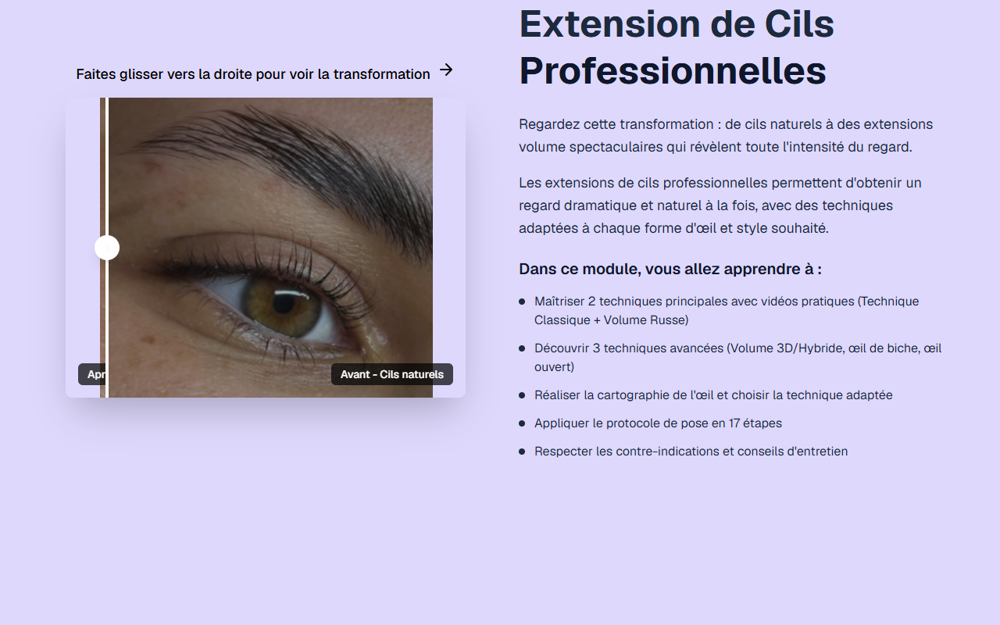

# Intro Slider — Extension de Cils

**Course:** Extension de Cils  
**Slide:** 1  
**Live URL:** https://lashextensione.edtechiecorp.com  
**Stack:** Next.js · Tailwind CSS · TypeScript · GitHub Pages  

## What this slide does

Opening intro slider for the French lash extension course, introducing the course name, learning objectives, and a visual preview of the lash styles learners will master. The slider sets expectations for the module and immediately engages learners with professional imagery of finished lash extension looks.

## Screenshot

## Usage

This slide is embedded as an iframe inside Coassemble at the live URL above. DNS is managed via Cloudflare (`edtechiecorp.com`). To update the slide, push to the `main` branch — GitHub Actions will rebuild and redeploy automatically.
